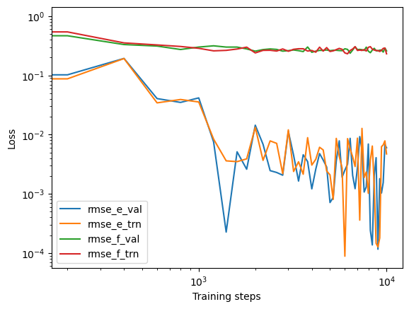
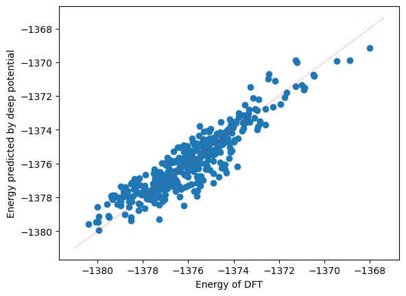

# deep_potential_NbTaMoW_FLiBe_interface
A collection of .ipynb scripts for Jupyter Notebook for training a potential energy model from ab initio molecular dynamics simulations using the deep learning package Deepmd kit

## Install DeePMD-kit
See https://docs.deepmodeling.com/projects/deepmd/en/v2.2.3/getting-started/install.html for installation instructions.

> **Note:** VASP simulation data can be downloaded from Zenodo at https://doi.org/10.5281/zenodo.15699534 for preparing the training and the testing data from molecular dynamics trajectories for the NbTaMoW_FLiBe interface.

## Preparing the training and testing data

```python
import dpdata
import numpy as np

# The training data utilized by DeePMD-kit comprises essential information such as atom type, simulation box, atom coordinate, atom force, system energy, and virial.
# A snapshot of a molecular system that includes this data is called a frame. Multiple frames with the same number of atoms and atom types make up a system of data. For instance, a molecular dynamics trajectory can be converted into a system of data, with each time step corresponding to a frame in the system.

# Load data from VASP OUTCAR files. In addition to the number of atoms, atom types and coordinates from the POSCAR file, LabeledSystem contains system energy, forces and virials calculated in the OUTCAR file.
system = dpdata.LabeledSystem("./OUTCAR_10ps", fmt="vasp/outcar")
nframes = len(system)
print(f"# the system contains {len(system)} frames")

# randomly choose 50 unique indices, which will be used to carve out a validation set from nframes - the collection of molecular dynamics snapshots.
rng = np.random.default_rng()
index_validation = rng.choice(nframes, size=50, replace=False)

# all other indexes are training_data
index_training = list(set(range(nframes)) - set(index_validation))
data_training = system.sub_system(index_training)
data_validation = system.sub_system(index_validation)

# all training data put into directory: "training_data"
data_training.to_deepmd_npy("salt-alloy/data/training_data")

# all validation data put into directory: "validation_data"
data_validation.to_deepmd_npy("salt-alloy/data/validation_data")

print(f"# the training data contains {len(data_training)} frames")
print(f"# the validation data contains {len(data_validation)} frames")
```

```
# the system contains 463 frames
# the training data contains 413 frames
# the validation data contains 50 frames
```

```python
# The mapping can be given by the file type_map.raw.
! cat salt-alloy/data/training_data/type_map.raw
```

```
Li
Be
F
Mo
Nb
Ta
W
```

```python
# Determine the number of each atom type mapped to Li Be F Mo Nb Ta W.
types, counts = np.unique(np.loadtxt("salt-alloy/data/training_data/type.raw", dtype=int), return_counts=True)
for t, c in zip(types, counts):
    print(f"type {t}: {c}")
```

```
type 0: 28
type 1: 14
type 2: 56
type 3: 20
type 4: 20
type 5: 20
type 6: 20
```

## Training the potential

```python
# Train the deep potential model from input.json; progress is logged to lcurve.out.
! OMP_NUM_THREADS=4 DP_INTRA_OP_PARALLELISM_THREADS=4 DP_INTER_OP_PARALLELISM_THREADS=2 dp train input.json
```

```python
import numpy as np
import matplotlib.pyplot as plt
import pandas as pd

# Plot the learning curve: energy/force RMSE for train and validation vs training step.
with open("lcurve.out") as f:
    headers = f.readline().split()[1:]
lcurve = pd.DataFrame(np.loadtxt("lcurve.out"), columns=headers)
legends = ["rmse_e_val", "rmse_e_trn", "rmse_f_val", "rmse_f_trn"]
for legend in legends:
    plt.loglog(lcurve["step"], lcurve[legend], label=legend)
plt.legend()
plt.xlabel("Training steps")
plt.ylabel("Loss")
plt.show()
```



## Validating the potential

```python
# Freeze the trained model into a single graph.pb file.
! dp freeze -o graph.pb
```

```python
import dpdata

# Predict energies for the training set with the frozen model.
training_systems = dpdata.LabeledSystem("../data/training_data", fmt="deepmd/npy")
predict = training_systems.predict("graph.pb")
```

```python
import matplotlib.pyplot as plt
import numpy as np

# Compare DFT energies against deep-potential predictions; a tight cluster along y = x means good agreement.
plt.scatter(training_systems["energies"], predict["energies"])

x_range = np.linspace(plt.xlim()[0], plt.xlim()[1])

plt.plot(x_range, x_range, "r--", linewidth=0.25)
plt.xlabel("Energy of DFT")
plt.ylabel("Energy predicted by deep potential")
plt.plot()
```


